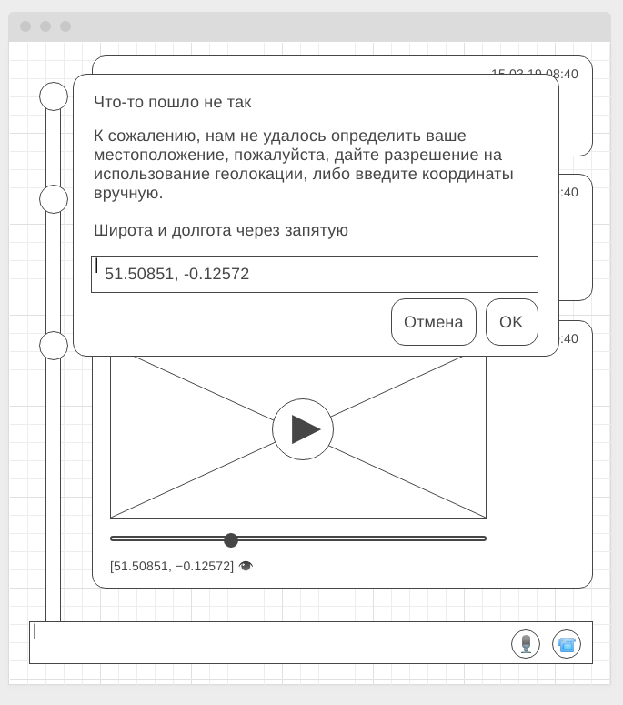

# Домашнее задание №1 к лекции «Geolocation, Notification, Media»

[Ссылка на Github Pages](https://yuriyvyatkin.github.io/ahj-hw-10.1-geolocation/)

## Задача 1. Текстовые записи с координатами

При создании текстовой записи (пользователь вводит текст в нижнее поле ввода и нажимает Enter) запросите координаты пользователя (через Geolocation API). Если координаты доступны, то добавьте сообщение в Timeline. Если же координаты не доступны - выведите пользователю соответствующее предупреждение с помощью модального окна и предложите указать координаты вручную (в реальном приложении, вы, конечно, будете использовать провайдера карт, но мы пока поступим именно так):

Напишите авто-тест для функции, которая будет обрабатывать пользовательский ввод координат, при этом функция корректно должна обрабатывать следующие ситуации (и выводить объект содержащий широту и долготу):
1. 51.50851, −0.12572 (есть пробел)
1. 51.50851,−0.12572 (нет пробела)
1. [51.50851, −0.12572] (есть квадратные скобки)

При несоответствии формата функция должна генерировать исключение, которое должно влиять на валидацию поля (валидацию мы проходили).
